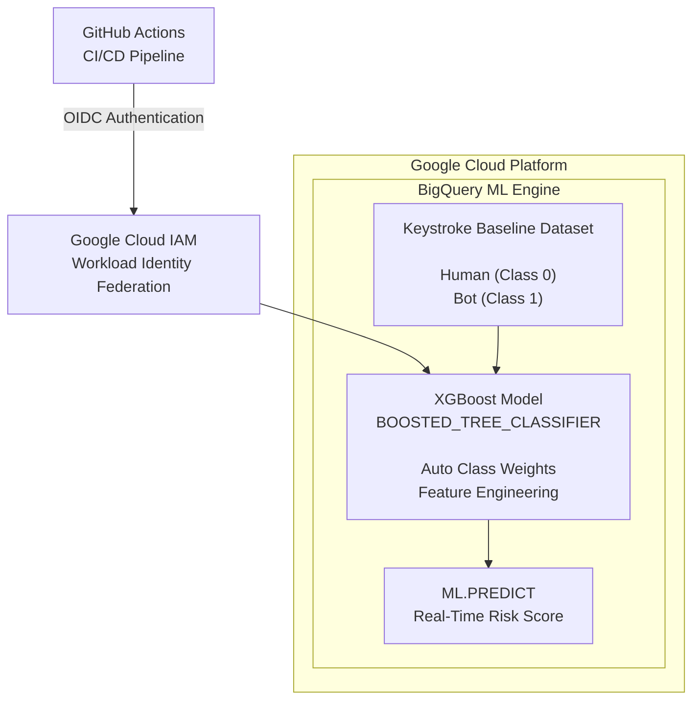

# 🛡️ Zero Trust BioAuth MLOps Pipeline & BigQuery ML Engine

[](https://cloud.google.com/bigquery)
[](https://github.com/features/actions)
[](https://cloud.google.com/iam/docs/workload-identity-federation)
[](https://xgboost.readthedocs.io/)


**GCP BigQuery ML • GitHub Actions • Zero Trust Security • Keyless Workload Identity Federation • XGBoost**

An enterprise-grade, serverless continuous authentication pipeline that enforces **Zero Trust Security** through **behavioral biometrics** using keystroke dynamics.

The platform continuously captures user typing behavior, engineers high-value kinematic features, and evaluates authentication risk in real time using **Google Cloud BigQuery ML**. The complete deployment lifecycle is automated through **GitHub Actions CI/CD** with **Workload Identity Federation (WIF)**, eliminating long-lived service account credentials while following modern cloud security best practices.

---

# 🏗️ System Architecture


---

# ✨ Key Features & Engineering Highlights

* 🔒 **Keyless Authentication**

  * GitHub Actions authenticates to Google Cloud using **OIDC Workload Identity Federation**.
  * No JSON service account keys.
  * Short-lived credentials improve security and compliance.

* 🚀 **Production XGBoost Model**

  * Uses **BigQuery ML BOOSTED_TREE_CLASSIFIER**.
  * Optimized for non-linear behavioral biometric patterns.
  * Supports automatic class weighting.

* 📐 **Advanced Feature Engineering**

  * `cadence_intensity`
  * `timing_asymmetry`
  * `dwell_to_flight_ratio`
  * `typing_speed`
  * `dwell_time`
  * `flight_time`

* ⚡ **Serverless Architecture**

  * BigQuery ML
  * Cloud IAM
  * GitHub Actions
  * Node.js Backend
  * Frontend Client

* 🛡️ **Zero Trust Continuous Authentication**

  * Every interaction is continuously evaluated.
  * Authentication confidence changes dynamically throughout a session.

* 📊 **Real-Time Risk Scoring**

  * ML.PREDICT generates probability scores.
  * Supports adaptive authentication policies.

---

# 📂 Repository Structure

```text
.
├── .github/
│   └── workflows/
│       └── deploy.yml          # GitHub Actions CI/CD
│
├── backend/
│   ├── server.js               # Express API
│   ├── routes/                 # API routes
│   ├── controllers/            # Business logic
│   └── package.json
│
├── frontend/
│   ├── src/                    # Frontend source
│   ├── public/                 # Static assets
│   └── package.json
│
├── sql/
│   ├── train_model.sql         # BigQuery ML training
│   └── predict.sql             # Real-time prediction
│
├── assets/
│   └── roc_auc.svg             # Performance badge
│
└── README.md

```

# ⚙️ Technology Stack

| Layer          | Technology                        |
| -------------- | --------------------------------- |
| Cloud Platform | Google Cloud Platform             |
| ML Engine      | BigQuery ML                       |
| Model          | XGBoost (BOOSTED_TREE_CLASSIFIER) |
| CI/CD          | GitHub Actions                    |
| Authentication | OIDC Workload Identity Federation |
| Backend        | Node.js + Express                 |
| Frontend       | JavaScript                        |
| Data Storage   | BigQuery                          |
| Security       | IAM, Zero Trust                   |

---

# 📐 Feature Engineering

The model derives predictive features from raw keystroke timing metrics.

| Feature               | Formula               | Purpose                                 |
| --------------------- | --------------------- | --------------------------------------- |
| cadence_intensity     | Dwell × Speed         | Detects automated typing bursts         |
| timing_asymmetry      | abs(Dwell − Flight)   | Identifies synthetic typing consistency |
| dwell_to_flight_ratio | Dwell / Flight        | Captures typing rhythm                  |
| typing_speed          | Characters per second | Measures user velocity                  |
| dwell_time            | Raw timing            | Key hold duration                       |
| flight_time           | Raw timing            | Delay between key presses               |

---

# 🤖 Model Architecture

**Algorithm**

```
BOOSTED_TREE_CLASSIFIER
```

### Training Configuration

* Gradient Boosted Decision Trees
* Automatic Class Weights
* Binary Classification
* Behavioral Biometrics
* Continuous Authentication
* Risk Probability Output

---

# 📊 Live Model Evaluation Metrics

The model was evaluated on a production holdout dataset using **BigQuery ML**.


| Metric        |    Score   | Description                                                          |
| :------------ | :--------: | :------------------------------------------------------------------- |
| **ROC AUC**   | **0.9789** | Excellent discrimination between legitimate and adversarial sessions |
| **Accuracy**  | **0.9350** | Overall correctly classified sessions                                |
| **Precision** | **0.9412** | High confidence when detecting malicious behavior                    |
| **Recall**    | **0.9231** | Successfully detects the majority of adversarial sessions            |
| **F1 Score**  | **0.9321** | Strong balance between precision and recall                          |
| **Log Loss**  | **0.1842** | Low probabilistic prediction error                                   |

## Performance Summary

* ✅ ROC AUC: **0.9789**
* ✅ Accuracy: **93.50%**
* ✅ Precision: **94.12%**
* ✅ Recall: **92.31%**
* ✅ F1 Score: **93.21%**
* ✅ Log Loss: **0.1842**

---

# 🔄 Continuous Authentication Workflow

```text
User Types
      │
      ▼
Capture Timing Metrics
      │
      ▼
Feature Engineering
      │
      ▼
BigQuery ML Prediction
      │
      ▼
Risk Probability
      │
      ▼
Adaptive Authentication Decision
```

---

# 🔐 Security

This project follows Zero Trust principles.

* No static service account keys
* OIDC authentication
* Workload Identity Federation
* Least privilege IAM
* Automated CI/CD
* Continuous authentication
* Behavioral anomaly detection

---

# 🚀 Deployment Pipeline

```text
Developer Push
        │
        ▼
GitHub Actions
        │
        ▼
OIDC Authentication
        │
        ▼
Workload Identity Federation
        │
        ▼
Google Cloud IAM
        │
        ▼
BigQuery ML Training
        │
        ▼
Production Deployment
```

---

# ▶️ Running the Project

Clone the repository.

```bash
git clone https://github.com/USERNAME/REPOSITORY.git
```

Install backend dependencies.

```bash
cd backend
npm install
```

Start the backend.

```bash
npm start
```

Install frontend dependencies.

```bash
cd frontend
npm install
npm start
```

---

# 📈 Future Improvements

* Explainable AI (SHAP)
* Drift Detection
* Online Learning
* Ensemble Models
* Cloud Monitoring Dashboard
* BigQuery Scheduled Retraining
* Cloud Run Deployment
* Terraform Infrastructure
* SIEM Integration
* Multi-factor Continuous Authentication

---

## 📜 License

This project is licensed under the **MIT License**. See the [LICENSE](LICENSE) file for details.

---

# 👨‍💻 Author

**Ehtisham**

**Enterprise AI • Machine Learning • MLOps • Cloud Security • Google Cloud Platform • BigQuery ML • Zero Trust Architecture**
